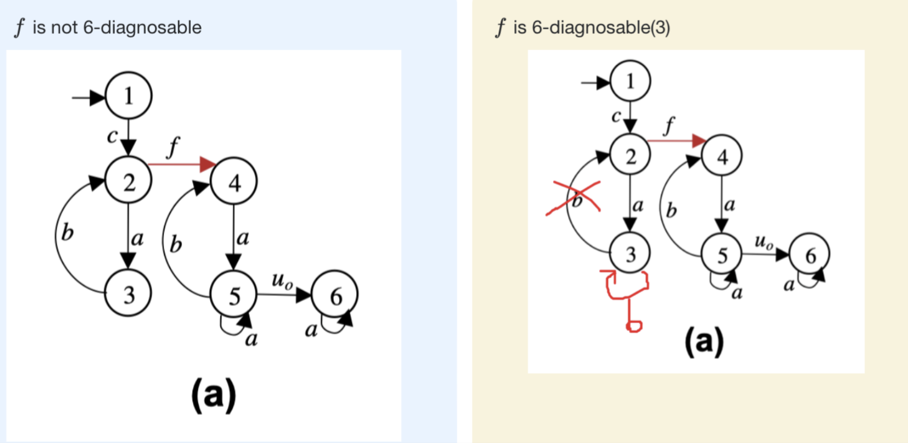

# Demo3 - Fault Diagnosis

```python
import pyuppaal as pyu
import os
import time
from typing import List, Tuple, Dict, Set, Optional, Union

print(pyu.__version__)

def bring_to_root(file_name: str):
    # ROOT_DIR = os.path.dirname(os.path.abspath(__file__))
    ROOT_DIR = os.path.dirname("C://Users//Taco//Documents//GitHub//cav2024//Demo-Diagnosability//")
    return os.path.join(ROOT_DIR, file_name)

pyu.DeveloperTools.set_verifyta_path_dev()

# If you want to see the detailed pattern, you need to keep tmp file for tracer.
keep_tmp_file = False
```

    1.2.1

## Toy Example Diagnosability



```python
A = pyu.UModel(bring_to_root('toy_model_diagnosable.xml'))
B = pyu.UModel(bring_to_root('toy_model_not_diagnosable.xml'))

# Load both models
# A = pyu.UModel('model_A.xml')
# B = pyu.UModel('model_B.xml')
# Add observations, unobvservable events and faults
sigma_o = ['a', 'b', 'c', 'action']
sigma_un, sigma_f = ['f'], ['f']
n = 3

res_A = A.fault_diagnosability(fault=sigma_f[0], n=n, sigma_o=sigma_o, sigma_un=sigma_un, visual=True, keep_tmp_file=keep_tmp_file)
res_B = B.fault_diagnosability(fault=sigma_f[0], n=n, sigma_o=sigma_o, sigma_un=sigma_un, visual=True, keep_tmp_file=keep_tmp_file)

print(f"   A is 3-diagnosable: {res_A[0]}")
print(f"   B is 3-diagnosable: {res_B[0]}")
```

    3-diagnosability for 'f':   0%|          | 0/64 [00:00<?, ?it/s]   3-diagnosability for 'f': 100%|██████████| 64/64 [00:06<00:00, 10.28it/s]
       3-diagnosability for 'f':   6%|▋         | 4/64 [00:01<00:19,  3.08it/s]

    A is 3-diagnosable: True
       B is 3-diagnosable: False
